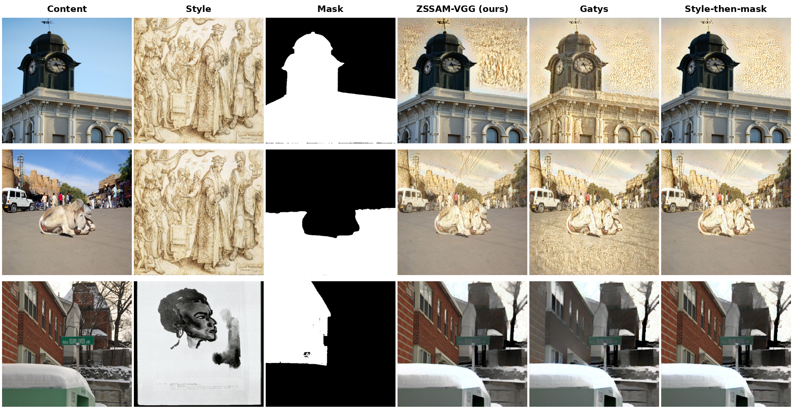

# ZSSAM-VGG

**Zero-Shot Segmentation Guided Masked Neural Style Transfer**

<p align="center">
  
</p>
<p align="center">
  <em>Content · style · SAM 2 mask · ZSSAM-VGG (ours) · global Gatys · post-hoc paste.</em><br>
  <em>Our method keeps the foreground sharp while stylising the background.</em>
</p>

ZSSAM-VGG applies an artistic style to the **background** of an image while leaving the
**foreground** object untouched. A foreground mask is obtained automatically from the
Segment Anything Model 2 (SAM 2) with no training and no prompt; the VGG-19 Gram-matrix
style loss of Gatys et al. is then restricted to the background, and the foreground is
held fixed throughout optimisation by gradient masking and a pixel-lock projection.

Abbreviations used below: **SAM 2** = Segment Anything Model 2; **VGG-19** = the 19-layer
VGG convolutional network; **SSIM** = structural similarity index (0 = dissimilar,
1 = identical); **LPIPS** = learned perceptual image patch similarity; **MS-COCO** =
Microsoft Common Objects in Context dataset.

## Method

1. **Automatic mask.** SAM 2 (Hiera-Large backbone) proposes object masks for the content
   image. The largest mask whose area lies between 15% and 70% of the image is selected as
   the protected foreground.
2. **Background-only style loss.** The VGG-19 Gram-matrix style loss is applied only to the
   background region.
3. **Full-style target on a matched scale.** The style target is the Gram matrix of the
   *entire* style image, normalised by the number of active pixels, so the masked-background
   statistics and the reference style are on the same scale.
4. **Foreground protection.** After each optimiser step the foreground gradient is zeroed
   (gradient masking) and the foreground pixels are reset to the original content
   (pixel-lock projection), so the foreground emerges identical to the input.

Two baselines are included for comparison:
- **Global Gatys** — the original method; stylises every pixel.
- **Style-then-mask** — Masked style transfer baseline defined by Seyed et al. (*Improving Masked Style Transfer using Blended Partial Convolution*, arXiv:2508.05769, 2026).

## Results

Evaluated on **760 content-style pairs** (76 MS-COCO content images x 10 WikiArt styles),
mean +/- standard deviation. Arrows show whether higher (^) or lower (v) is better.

| Metric | ZSSAM-VGG (ours) | Style-then-mask | Global Gatys |
|---|---|---|---|
| Protected-region SSIM ^ | **0.982 +/- 0.012** | 0.975 +/- 0.017 | 0.445 +/- 0.168 |
| Background style fidelity v | **0.060 +/- 0.022** | 0.137 +/- 0.085 | 0.128 +/- 0.079 |
| Background (stylised) SSIM v | **0.419 +/- 0.127** | 0.451 +/- 0.125 | 0.452 +/- 0.125 |
| Global SSIM ^ | 0.630 +/- 0.111 | 0.647 +/- 0.114 | 0.449 +/- 0.129 |
| LPIPS | 0.308 +/- 0.073 | 0.306 +/- 0.074 | 0.479 +/- 0.085 |

ZSSAM-VGG preserves the foreground almost perfectly (protected-region SSIM 0.982 versus
0.445 for global Gatys) and matches the style in the background roughly 2.3x more faithfully
than the style-then-mask baseline. All differences on foreground preservation and background
style fidelity are significant under a paired Wilcoxon signed-rank test (p < 1e-100).

Per-pair results are in [`results_colab.csv`](results_colab.csv); a qualitative comparison
is in [`figs/fig_qualitative.png`](figs/fig_qualitative.png).

## Repository contents

```
ZSSAM_VGG_Batch.ipynb   Batch runner (Colab): SAM 2 + VGG-19, all three methods, checkpointed
results_colab.csv       Per-pair metrics for the 760 pairs
figs/fig_qualitative.png  Qualitative comparison figure
```

## How to run

The notebook is written for Google Colab with an NVIDIA A100 GPU and data on Google Drive.

1. Open `ZSSAM_VGG_Batch.ipynb` in Colab and select a GPU runtime.
2. Put the datasets on your Drive and set the paths in the CONFIG cell:
   - `CONTENT_DIR` -> a folder of MS-COCO images
   - `STYLE_DIR` -> a folder of WikiArt style images
3. Run the cells top to bottom. Set `TEST_MODE = True` first to check one pair, then
   `TEST_MODE = False` for the full run.
4. Results are appended to `results_colab.csv` after every content image, so a disconnected
   session resumes instead of restarting. Section 12 saves example figures.

Key configuration knobs: `N_CONTENT`, `N_STYLES`, `IMG_SIZE`, `EPOCHS`, `STYLE_WEIGHT`,
`AREA_MIN` / `AREA_MAX` (the mask area band), `SEED`.

## Data

Content images are from MS-COCO 2014 and style images from WikiArt. Neither dataset is
redistributed here; download them from their sources and point the notebook at your copies.

## Dependencies

Python 3, PyTorch, torchvision, the SAM 2 package with the Hiera-Large checkpoint,
`lpips`, `scikit-image`, `pillow`, `numpy`, `pandas`, `matplotlib`. The notebook installs
what Colab does not ship with in its first cells.

## Authors

Deborah Osafroadu-Amankwah, Kwabena Owusu-Agyemang, and Chrisvy Kehn Opportun Itoua
(Department of Computer Science, Kwame Nkrumah University of Science and Technology, Kumasi,
Ghana).

## Licence

MIT. See [`LICENSE`](LICENSE).

